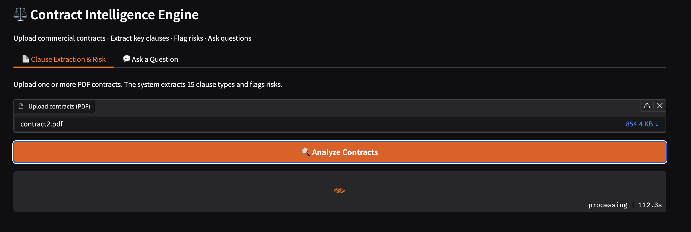
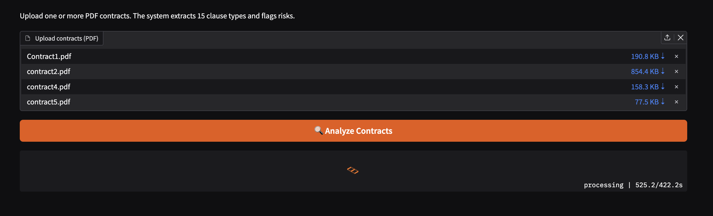

```text
╔══════════════════════════════════════════════╗
║      ⚖️ CONTRACT INTELLIGENCE ENGINE         ║
║   AI-Powered Contract Analysis System       ║
╚══════════════════════════════════════════════╝
```

# ⚖️ Contract Intelligence Engine

> 🚀 Upload contracts → Extract clauses → Detect risks → Ask questions
> ⚡ Typical processing time: **20–40 seconds**

---

## 🔥 Live Preview

### 🧠 Upload & Analyze Contracts



---

### ⚡ Batch Processing in Action



---

### 📊 Extracted Clauses & Risk Detection


---

## 🎯 Overview

An **AI-powered contract intelligence system** that automates legal document understanding using a hybrid pipeline of:

* 🤖 Machine Learning (Legal-BERT)
* 📊 Rule-based extraction
* ❓ Question Answering models

---

## 🧠 Key Features

### 📄 Clause Extraction

* Extracts **15+ clause types**
* Identifies:

  * Parties
  * Governing Law
  * Agreement Name

### ⚠️ Risk Detection Engine

* 🚨 HIGH RISK → Missing liability cap
* ⚠️ MEDIUM RISK → Missing termination clause
* 📉 COMPLIANCE → Missing governing law

### ⚡ Performance Optimized

* Fast chunking for large PDFs
* Batch processing support
* Optimized inference pipeline

---

## ⚙️ Architecture

```text
PDF → Text Extraction → Chunking → 
→ ML Models (Legal-BERT) 
→ QA Engine → Rule Engine → Risk Engine → UI
```

---

## 📂 Project Structure

```bash
Contract_viewer/
│── assets/               # Screenshots
│── models/               # Trained models
│── scripts/              # Processing pipeline
│── app.py                # Gradio UI
│── requirements.txt
│── README.md
```

---

## ⚡ Setup Instructions

### 1️⃣ Clone Repository

```bash
git clone https://github.com/Ritviksingh-cyber/Contract_viewer.git
cd Contract_viewer
```

---

### 2️⃣ Install Dependencies

```bash
pip install -r requirements.txt
```

---

### 3️⃣ Run Application

```bash
python app.py
```

---

### 4️⃣ Open UI

```
http://localhost:7860
```

---

## 🧪 How It Works

| Step | Process                        |
| ---- | ------------------------------ |
| 1    | Upload contract PDFs           |
| 2    | Extract text using PyMuPDF     |
| 3    | Chunk document                 |
| 4    | Run ML + rule-based extractors |
| 5    | QA model extracts clauses      |
| 6    | Risk engine evaluates          |
| 7    | Results displayed in UI        |

---

## 📊 Example Output

* 📄 **Contract Name:** Data Processing Agreement
* 👥 **Parties:** Automatically extracted
* ⚖️ **Governing Law:** Identified or flagged
* ⚠️ **Risks Detected:**

  * HIGH: No liability cap
  * MEDIUM: Missing termination clause

---

## 🛠️ Tech Stack

* Python
* PyTorch
* HuggingFace Transformers
* Gradio
* PyMuPDF

---

## 🚀 Future Improvements

* 🌍 Multi-language support
* ☁️ Cloud deployment
* 📊 Analytics dashboard
* 🔍 Better clause detection

---

## 👨‍💻 Author

**Ritvik Singh**
AI/ML Engineer | NLP Enthusiast

---

## ⭐ Support

If you found this useful:

```bash
⭐ Star this repo
🍴 Fork it
🚀 Build on top of it
```

---

## ⚠️ Disclaimer

This tool assists in contract analysis but **does not replace legal advice**.

---
